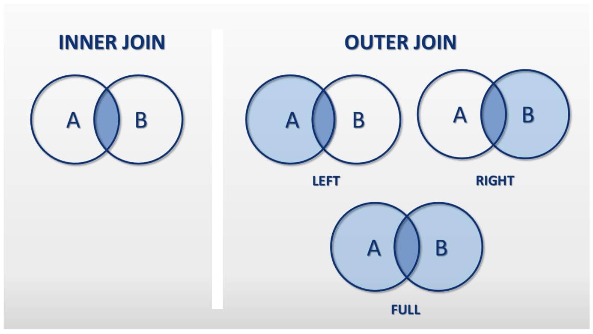

# NOTES

## DB 

- *users* 1 - N *cards*
- *users* 1 - N *addresses*

- Update table with random integer : `UPDATE tbl_name SET column_name = CAST(RAND() * 10000<any range on number> AS UNSIGNED)`

 ## JOINS



### Information

- FULL JOIN === FULL OUTER JOIN *Does not work in MySQL*
- LEFT OUTER JOIN === LEFT JOIN
- RIGHT OUTER JOIN === RIGHT JOIN
- INNER JOIN === JOIN
<br>

**Above illustration A is` users`, B is `cards`**
<br>

> SELECT U.id, U.fname, U.lname, C.type, C.amount
FROM `users` AS U 
INNER JOIN `cards` AS C 
WHERE C.uid = U.id

*Return only matched - 300,000 results*
<br>

> SELECT U.id, U.fname, U.lname, C.type, C.amount
FROM `users` AS U 
LEFT JOIN `cards` AS C 
ON C.uid = U.id

*Return matched & all in users - 2,969,158 results*
<br>

> SELECT U.id, U.fname, U.lname, C.type, C.amount
FROM `users` AS U 
RIGHT JOIN `cards` AS C 
ON C.uid = U.id

*Return matched & all in cards - 300,000 results*
<br>

> SELECT *
FROM users
CROSS JOIN cards

*Return combinations of each row of users < first_table > with **all** records in cards < second_table > - 886,334,700,000 results*
<br>

## HAVING / GROUP BY / UNION

### Reference

- The GROUP BY statement is often used with aggregate functions (COUNT(), MAX(), MIN(), SUM(), AVG()) to group the result-set by one or more columns.
- https://www.w3schools.com/sql/sql_groupby.asp

> SELECT U.id, U.fname, U.lname, C.amount
FROM `users` AS U 
INNER JOIN `cards` AS C 
ON C.uid = U.id
HAVING U.id < 100

*Return only matched & all user.id < 100 - 14 results*
<br>

> SELECT sum(amount), type
FROM cards
GROUP BY type
ORDER BY type ASC

*Return 5 type of card with sum of amount per card type - 5 results*
<br>

> SELECT concat('C', C.id) AS id, C.uid, 'Cards' AS status
FROM cards AS C
UNION
SELECT concat('A', A.id) AS id, A.uid, 'Addresses' AS status
FROM addresses AS A

*Return all of cards & all of addresses, **note that columns need to be of the same type** - 598,862  results*
<br>

## VIEW

> CREATE VIEW view_1 AS
SELECT U.id, U.fname, U.lname, C.amount
FROM `users` AS U 
INNER JOIN `cards` AS C 
ON C.uid = U.id
HAVING U.id < 100

*Will create view_1 in phpMyAdmin listed under Structure with type:**View***
<br>

---

# Additional Notes

- https://dev.mysql.com/doc/refman/8.0/en/json-creation-functions.html ( Functions That Create JSON Values)

```sql
SELECT 
vip_list.id AS id,
vip_list.name AS name,
vip_list.surname AS surname,
JSON_OBJECT(
    'qa', vip_list.qa,
    'status', vip_list.status,
    'net_worth', vip_list.net_worth,
    'registered_at', vip_list.registered_at
) AS details
from vip_list
```